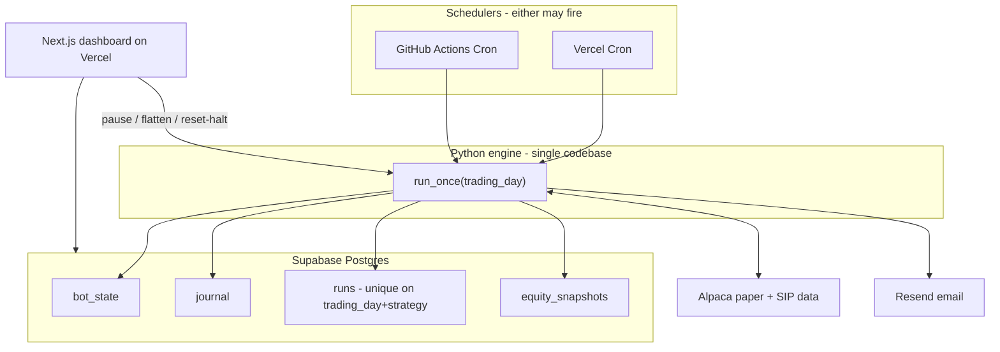

# Architecture

How the hosted paper swing bot is structured: one Python engine, two schedulers,
Postgres as truth, and a read-mostly Next.js dashboard. Written for someone new
to algo trading who wants to understand the whole path before touching code.

## System overview

**Design principle:** the engine is stateless between invocations. Each scheduled
run loads state from Postgres, does its work, writes results back, and exits.
The same `run_once()` function runs locally (CLI), on Vercel (serverless), and
in GitHub Actions (batch step). No subprocess calls to `main.py` from the web
layer — import the modules directly.

## Daily run path (after the close)

Intended schedule: once per trading day, ~5:00–5:30pm Eastern, after the
market has closed and the daily bar is final.

1. **Scheduler fires** (Vercel Cron and/or GitHub Actions). Either may run;
   both are safe because step 3 enforces idempotency.

2. **Resolve trading day.** Call Alpaca's market calendar for `America/New_York`.
   Do not use `date.today()` — on a UTC server after 4pm ET, UTC date is already
   tomorrow. Half-days and holidays come from the calendar, not from guessing.

3. **Claim the run.** Insert into `runs` with `(trading_day, strategy)`. A
   unique constraint on that pair means the second scheduler gets a conflict
   and exits without trading. This is why dual schedulers work: the database
   decides, not application logic racing.

4. **Load state.** Read `bot_state` (peak equity, halt flags, pause flag,
   day-start equity for the current trading day). If hard-halted or paused,
   journal and notify, then exit.

5. **Connect to broker.** `PaperBroker()` — three paper checks unchanged
   (config flag, `paper=True`, account number starts with "PA").

6. **Risk limits first.** `check_limits()` before any signal. Daily-loss and
   drawdown halts may flatten and stand down. See risk.py; limits are not
   optional.

7. **Fetch bars.** Daily OHLCV from Alpaca SIP (historical bars >15 min old
   are consolidated feed, free). Same functions for backtest and live.

8. **Compute signals.** `desired_position_today()` per symbol — deterministic
   rules from STRATEGY.md. No LLM, no discretion.

9. **Reconcile and size.** Compare desired vs held positions; `size_shares()`
   enforces cash-only, whole shares, MAX_POSITION_PCT. Cap concurrent entries
   (lowest RSI wins when both SPY and QQQ signal).

10. **Submit orders** (unless shadow mode or paused). Market DAY orders queue
    for the next open — same execution model as the backtester.

11. **Persist.** Append journal rows, update `bot_state`, snapshot equity to
    `equity_snapshots`, mark run complete.

12. **Notify.** Resend daily digest email; on halt/error, separate alert class.

The dashboard does not participate in steps 1–12 unless you manually trigger
flatten or reset-halt. There is no buy button.

## Trading-day model

Implemented in `trading_day.py`. All bot session keys go through these helpers —
never `date.today()` in the run path.

| Concept | Rule |
|--------|------|
| Timezone | `America/New_York` via `zoneinfo` (`trading_day.ET`). |
| Trading day | `resolve_trading_day(now)` → Alpaca calendar lookup for the ET wall date; `None` on weekends/holidays. |
| After-close run | Same session date as the bar that just closed (ET), even when UTC date has rolled. |
| Day-start equity | Morning job uses the same `resolve_trading_day()` as after-close. |
| Half-days | `Session.is_half_day` / `is_half_day(date)` when close is before 16:00 ET (Alpaca early close). |
| UTC servers | After ~8pm ET, `datetime.now(timezone.utc).date()` is already tomorrow; ET session date is not. |

**Example:** Mon 2026-07-27 21:00 EDT == Tue 2026-07-28 01:00 UTC → trading day
remains `2026-07-27`.

**Why this matters:** without ET + calendar, a hosted cron keys state to the wrong
day and the daily-loss / idempotency guards break. Day-start equity is still
captured in a separate morning job (`capture_day_start`); after-close only
`update_peak` (see Part A2).

Calendar fetch uses `TradingClient.get_calendar` (injectable for tests).
Docs: https://alpaca.markets/sdks/python/

## Look-ahead bias (signal semantics)

Sacred invariant from strategy.py and backtest.py:

- `position[t] == 1` means "hold starting at bar **t+1's open**."
- Signals use only data available at bar **t's close**.
- Live loop: run after today's close → order fills tomorrow's open.
- Backtester: `target = pos.iloc[t-1]`, fill at `open.iloc[t]`.

If code and this document disagree, that's a bug. Any change touching signals
or the backtester must explain why no look-ahead was introduced.

## Postgres schema (deployed path)

Local development may still use `state.json` and `journal.csv` until Part B
migrates state. Production uses only Postgres.

### `bot_state` (single row or key-value)

| Column | Purpose |
|--------|---------|
| peak_equity | High-water mark for drawdown halt |
| day_start_equity | Equity at open capture for daily-loss halt |
| day_start_trading_day | Which session day_start applies to |
| halted | Hard drawdown halt until reset-halt |
| halted_reason | Human-readable reason |
| day_halted_trading_day | Soft daily-loss halt (clears next session) |
| paused | Operator pause from dashboard (no new orders) |
| updated_at | Last write timestamp (ET) |

### `runs`

| Column | Purpose |
|--------|---------|
| trading_day | DATE, America/New_York session |
| strategy | e.g. `rsi2` |
| started_at | When run began |
| completed_at | NULL if crashed mid-run |
| status | `ok`, `halt`, `error`, `skipped_duplicate` |
| mode | `shadow`, `submit` |

**Unique constraint:** `(trading_day, strategy)` — dual-scheduler idempotency.

### `journal`

Same fields as journal.csv (timestamp, symbol, action, qty, ref_price, reason,
equity, cash, dry_run) plus optional `actor` for dashboard-initiated actions.

### `equity_snapshots`

Daily (or per-run) equity, cash, and positions hash for paper-vs-backtest charts.

### `gate_results` (Phase 2, optional)

Strategy name, criterion, threshold, measured value, pass/fail — feeds the gate
scoreboard in the dashboard.

Migrations live in `supabase/migrations/` (created in Part B). Never store API
keys in any table.

## Portability requirement

`run_once(trading_day: date, *, submit: bool, shadow: bool) -> RunResult`

- **No** reads or writes to local files in the deployed path.
- **No** global mutable state between invocations.
- **Yes** injectable store interface (Postgres in prod, files in local dev if
  needed during transition).

This lets you upgrade hosting without rewriting strategy logic:

| Host | How `run_once` runs |
|------|---------------------|
| GitHub Actions | `python -m engine run --trading-day …` |
| Vercel | Python serverless handler calls `run_once()` |
| Railway/Fly (paid) | Long-lived loop calls `run_once()` each tick or day |

## Web layer boundaries

Next.js on Vercel:

- **Reads:** Supabase (journal, state, equity) via authenticated API routes or
  Supabase client with RLS scoped to the owner user.
- **Writes:** Only pause, flatten, reset-halt — each calls Python engine
  endpoints with server-side Alpaca keys, journals `actor`.
- **Never:** Recompute RSI, size shares, or submit buys from TypeScript.

See WEBUI.md for layout and NOTIFICATIONS.md for email templates.

## Security summary

- Public repo: strategy code only; secrets in Vercel/Actions/Supabase env.
- Supabase Auth: one user, signups disabled.
- Going live: private repo + rotate all keys same day (README checklist).

## Repo map (engine + docs)

| File | Role |
|------|------|
| config.py | Tunables and risk limits |
| data.py | Bars + indicators (Alpaca in hosted path) |
| strategy.py | Rules → position series |
| risk.py | Sizing, halts, state helpers |
| broker.py | Alpaca paper wrapper |
| backtest.py | Next-open simulator |
| engine / main | `run_once` and CLI |
| trading_day.py | America/New_York session dates via Alpaca calendar |
| ARCHITECTURE.md | This file |
| DEPLOY.md | Hosting setup |
| WEBUI.md | Dashboard spec |
| NOTIFICATIONS.md | Email and watchdog |
| CURSOR_PROMPTS.md | Phased build playbook |
